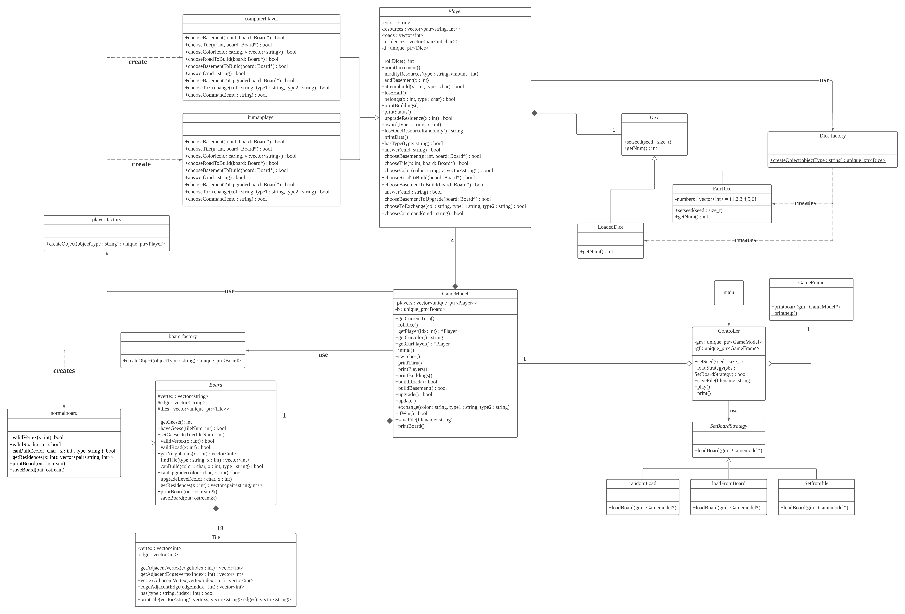
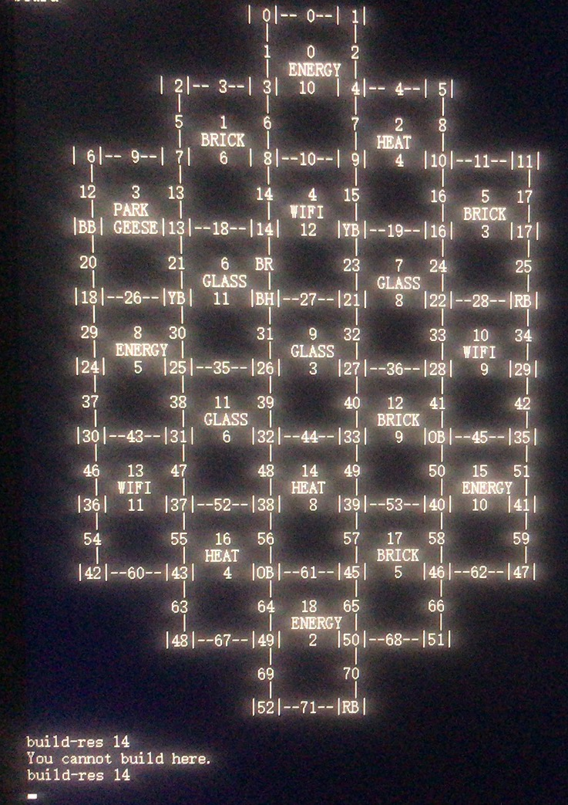
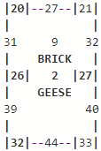

# Catan - CS246 final project
Bella, Andrew, Steven  final project CS246 Spring 2021 Project – Constructor

## Introduction
There are three different types of residences you can build. For each residence
built, you will earn a building point towards winning the game. Aside from that, residences will influence which materials
you receive, and where you and other builders will be able to build in the future.  

During the setup of the game, each player selects starting vertices. Once the game begins, each builder takes turns rolling
the dice to determine which tiles produce resources. After rolling, the builder who rolled the dice has the opportunity to build roads and residences using their resources.  

The goal of the game is to be the first of the four players to obtain 10 (or more) building points.

## UML

**Main** is used to get the command line message, compile and submit this message to the controller. **Controller, gamemodel** and **gameframe** build as `MVC`. All the logic staff of the game is done in the **controller**. **Gameframe** is just responsible for printing the staff in **gamemodel** to cout. **Gamemodel** contains all game data and objects (also method to modify them). All game object instances (class) are created by each `Factory method`. **SetBoardStategy**(abstract class) is used to set the initial board, so transfer a different **setBoardStrategy** to the **controller** and let the **controller** set the board by different strategy.
## Example

## Commands
### Beginning of Game
At the beginning of the game, each builder chooses two initial basements to build. The basements will be chosen by builders
in the order Blue, Red, Orange, Yellow, Yellow, Orange, Red, Blue.  
Each builder is prompted with the statement:  
Builder `colour`, where do you want to build a basement?  
Each builder responds with a number that represents a valid vertex.  
Once a valid vertex has been entered, prompt the next builder. Once all builders have placed their two basements, print the
updated board and begin the game.  
### Beginning of Turn
`load` sets the dice of the current builder to be loaded dice.  
`fair` sets the dice of the current builder to be fair dice.  
`roll` rolls the current builder’s dice. This ends the ”Beginning of the turn” phase and moves the builder to ”During the turn”.  
### During the Turn
`board` prints the current board  
`status` prints the current status of all builders in order from builder 0 to 3  
`residences` prints the residences the current builder has currently completed  
`build-road "road#"` attempts to builds the road at "road#"  
`build-res "housing#"` attempts to builds a basement at "housing#"  
`improve "housing#"` attempts to improve the residence at "housing#"  
`trade "colour" "give" "take"` attempts to trade with builder "colour" giving one resource of type "give" and receiving one resource of type "take"  
`next` passes control onto the next builder in the game. This ends the ”During the Turn” phase.  
`save "file"` saves the current game state to "file"  
`help` prints out the list of commands  
## Resilience to change the code
Our design can accommodate new features and changes to existing features easily.  
* If we want to use a `different way to print the game`, we can just directly add a new printing method and change the method to use in the gameframe. If we want to print the tile in a different way, we can just change the printing method in tile class. Same as the board printing method.  

* If we want to `support a new command-line`, we could add that command option in main and controller without influencing any existing parts.  

* If we want to `add a command for the user to use during the game`. For example, add -road command, which prints the roads that has been built of the builder, add the command option in controller and add one specific that implements the command in gamemodel.  

* If we want to `use other ways to generate the initial board`, we can just create a new strategy inherited from setBoardStrategy, let main transfer that into the controller.  

* If we want to set up a `different kind of board`(such as different sized or hexagonal), we create new board subclass inherited from the Board and let boardfactory produce its instance in gamemodel.  If we want to use `different player behaviour`, we let the new player inherited from the Player and playerfactory produce it. If we want to use a `different set of dice`(such as 12 sided dice, 24 sided etc) , we let the new dice inherited from the Dice and dice factory produce it.  

* If we want to `support a different number of players`, we set different number of instances in gamemodel.  

* If we want to `support different numbers of players and computer players`. For example, using 2 computer players and 2 human players, we can add a new command line option: -computer2, where the number indicates the number of computer players. By passing this command string from the controller to gamemodel, the gamemodel is able to use a different number of each player created by playerfactory  in its constructor.  

* If we want to `change computer players' strategy`, we can just change the specific choose method. For example, if we want to use a different strategy to choose the geese tile after rolled 7 for computer players, we can change the chooseTile function to check which tile has more builders and does not have itself’s residences. This way, we can easily change the strategy of computer players by changing the methods of choosing in computer player class.  

* If we want to `change the input syntax`, for example, read all the users’ input from a file, we could overload the operator >>  in the humanPlayer class.  

* If we want to `change the rules on building a residence or roads on the map`, we can simply change the specific function that implements the rule. For example, to change the resources that need to upgrade the residences, we can simply change one function called attemptBuild in the Player class. If the rules to build roads or vertices needed to be changed, simply implement the canBuild method in Board class differently.  

* If we want to use a `different way to save the game` into a file or another place, we only need to change the implementation of the function savefile() in the GameModel.  

* If we want to `implement a different rule` For example, when we roll 7(moving geese), we just need to change the implementation of the function update() in the GameModel. If we want to implement different rules to trade resources, we just need to change the implementation of the function chooseToExchange() in the Player.  

Overall, if we want to change the high level logic, we can change the implementation in MVC, if we want to change a specific rule or behaviour, we can simply change the single method which implements that functionality.
## Game information
### Board
The board is the visual representation of the state of the current game. The board will always display the 19 tiles present in the game, all edges and vertices, and the roads and residences the builders have completed. The representation for each of these components is described in their respective sections.
### Tiles
Each tile, displayed as a rectangle on the board, represents one type of resource in the game. The middle of each tile lists the tile number, the type of resource and the tile value, in this order. In Figure 1, the tile number is 9, the resource is BRICK and the tile value is 2. The tile number refers to where the tile is on the board. The tile value is used to determine which resources are allocated when the dice are rolled (discussed later). Additionally, if geese are present on the tile, it will be displayed as in Figure 1. The outline of each tile is composed of the edges and vertices surrounding it. There are 6 types of tile: BRICK, ENERGY, GLASS, HEAT, WIFI, and PARK. The Resources section discusses how resources and values are distributed. The PARK tile produces no resources.  
  
Figure 1: Sample Tile
### Geese
A tile can be overrun with geese, which play a similar role to that of the robber in the original game. In the event that a tile has been overrun by geese, builders will not receive resources when the value matching the tile is rolled.
### Vertices
A vertex is located at each corner and in the middle of each vertical edge of each tile. Each tile has 6 vertices. Note that most vertices are shared by multiple tiles. In Figure 1, the vertices are numbers 20, 21, 26, 27, 32, and 33.
### Housing Details
A residence can be built at a vertex. Only one builder can build at each vertex. Each vertex can have at most one of 3 types of residences on it. Once a builder has built a residence, they can improve the residence twice. When a residence is built, the display is updated by replacing the vertex with the first character of the colour of the owner, e.g. ‘B’ for “Blue”, followed by the first character of the name of the improvement, e.g. ‘B’ for “Basement”.  
Housing must be built in the following order:  
`Basement (B)` Building a basement gives the builder one resource when the value of any adjacent tile is rolled. When acquired, a basement gives the owner one building point. A basement costs one BRICK, one ENERGY, one GLASS, and one WIFI to build.  
`House (H)` Building a house gives the builder two resources when the value of any adjacent tile is rolled. When acquired, a house gives the builder one additional building point (2 in total). A house costs two GLASS, and three HEAT to build.  
`Tower (T)` Building a tower gives the builder three resources when the value of any adjacent tile is rolled. When acquired, a tower gives the builder one additional building point (3 in total). A tower costs three BRICK, two ENERGY, two GLASS, one WIFI and two HEAT to build.  
If a vertex currently has no residence on it, then a builder may construct a Basement there; on the same or a subsequent turn, that same builder may upgrade the Basement to a House, and later still may upgrade the House to a Tower. Once built, a residence cannot be removed or change owners.
### Edges
Edges are located at the edges of each tile, going between vertices. Each tile has 6 edges. Most edges are shared by multiple tiles.
For example, in Figure 1, the edges associated with the tile are numbers 27, 31, 32, 39, 40, and 44. Residence 38 is adjacent to edges 48, 52, and 56. If builder Red has built a road on edge 48, and builder Orange has a basement on residence 38, then Red may not build a road on either edge 52 or edge 56 (through vertex 38) unless it can approach legally from the other direction(s). In other words, you may not build through a residence of a different colour.
### Roads
Each edge can have at most one road built on it. When a road is built, the display is updated by replacing the edge number with the first character of the colour of the owner, e.g. ‘B’ for “Blue”, followed by ‘R’ for “Road”. Note that once a road has been built on a given edge, it will stay there for the remainder of the game. A builder can build a road only if an adjacent road or residence has been built by the same builder. The cost to build one road is one HEAT and one WIFI resource.
### Builders
All builders in the game are “human” or "Computer" players and controlled by the commands issued on standard input. Game have exactly 4 builders.
Each builder is assigned a colour at the beginning of the game with builder 0 being Blue, builder 1 being Red, builder 2 being Orange and builder 3 being Yellow.
### Dice
Two types of dice are supported by the game: loaded1 and fair dice. Each builder has their own set of dice to roll. When dice
are rolled, any builder who has a residence on a tile with the same value as the roll receives resources associated with the tile
and the residences present. When the game begins, all builders will have loaded dice.  
For example, in Figure 1, if a builder owned residence 21 and the dice rolled were 1 and 1 (i.e. the total is 2), the builder
will receive a BRICK resource.
#### Loaded Dice
When loaded dice are chosen, the builder is prompted with the statement:
Input a roll between 2 and 12:  
If the builder’s input is invalid, i.e. not an integer or out of the valid range, output the message:
Invalid roll.  
followed by the previous prompt.  
Once a valid roll has been entered, the entered roll is used for the turn.  
#### Fair Dice
When fair dice are chosen, two numbers are randomly generated, each between 1 and 6. The sum of the two generated
numbers are used for the turn.

